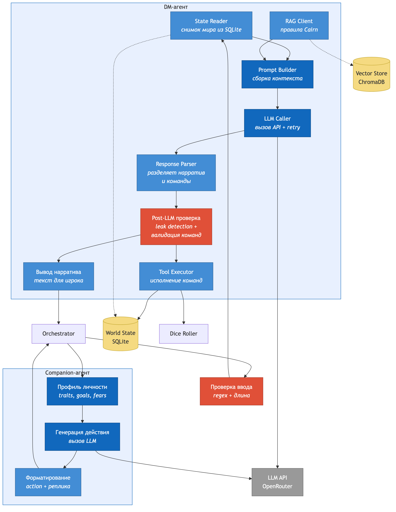

# C4 Component — DM Agent

Внутренности DM Agent и Companion Agent.

## DM-агент — компоненты

| Компонент | Вход | Выход | Что делает |
|-----------|------|-------|------------|
| **State Reader** | — | Снимок World State | Читает SQLite, формирует текстовое представление |
| **RAG Client** | Действие игрока | Релевантные правила | Embedding-запрос, top-k поиск |
| **Prompt Builder** | Снимок мира, RAG, история, действие | Готовый промпт | Сборка контекста с учётом бюджета токенов |
| **LLM Caller** | Промпт + схемы команд | Ответ LLM | Вызов API, retry при ошибках |
| **Response Parser** | Ответ LLM | Нарратив + команды | Разделяет текст и структурированный вывод |
| **Post-LLM проверка** | Нарратив + команды | Проверенный ответ | Leak detection + валидация команд |
| **Tool Executor** | Валидные команды | Обновлённый World State | Исполнение команд в SQLite-транзакции |
| **Вывод нарратива** | Проверенный текст | Ответ игроку | Форматирование под UI |

## Companion-агент — компоненты

| Компонент | Вход | Выход | Что делает |
|-----------|------|-------|------------|
| **Профиль личности** | Config-файл | System prompt | Traits, goals, fears — не меняются в рамках кампании |
| **Генерация действия** | Профиль + контекст | Ответ LLM | Решение персонажа на основе ситуации |
| **Форматирование** | Ответ LLM | `{action, target, реплика}` | Парсинг структурированного вывода, проверка полей |

## Как связаны

1. **Orchestrator** решает, нужен ли RAG — ищет ключевые слова механик в действии игрока.
2. **Tool Executor** при невалидной команде возвращает ошибку через Prompt Builder на повторный вызов.
3. **Post-LLM проверка** может заблокировать ответ — тогда LLM вызывается заново.
4. Действие компаньона приходит в DM-агент через Orchestrator — DM обрабатывает его так же, как ход игрока.
