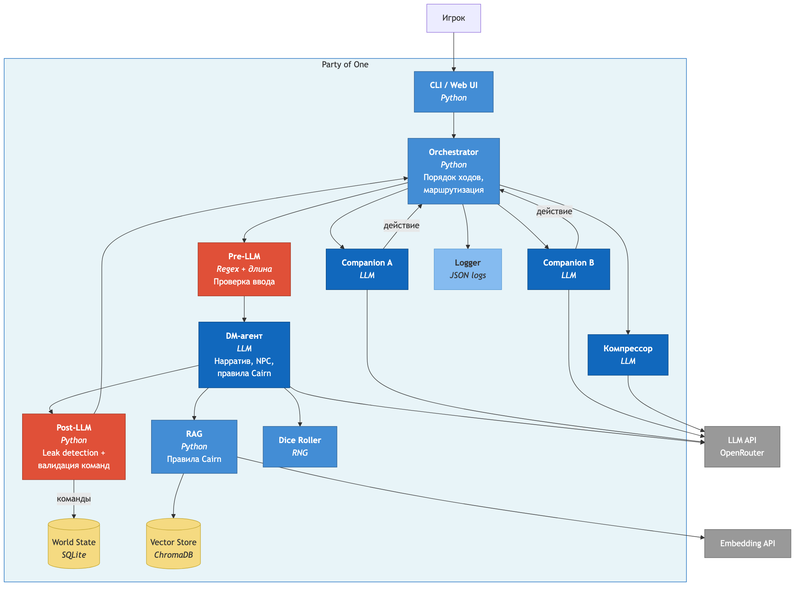

# C4 Container — Party of One

Что внутри: модули, хранилища, внешние сервисы.

## Легенда

| Цвет | Что это |
|------|---------|
| Тёмно-синий | LLM-агенты — ходят в LLM API |
| Средне-синий | Детерминированный Python-код |
| Красный | Guardrails |
| Жёлтый | Хранилища |
| Серый | Внешние сервисы |

## Потоки данных

- **UI → Orchestrator:** текст действия игрока
- **Orchestrator → Pre-LLM → DM:** проверенный ввод + контекст
- **DM → LLM API:** промпт со схемами команд
- **LLM API → DM:** нарратив + команды
- **DM → Post-LLM → World State:** проверенные команды записываются в SQLite
- **Companion → LLM API:** промпт с профилем и контекстом
- **LLM API → Companion:** действие + реплика
- **Companion → Orchestrator → DM:** действие компаньона уходит на обработку DM
- **RAG → Vector Store:** embedding-запрос → релевантные правила
- **Компрессор → LLM API:** старые ходы → сжатое изложение
