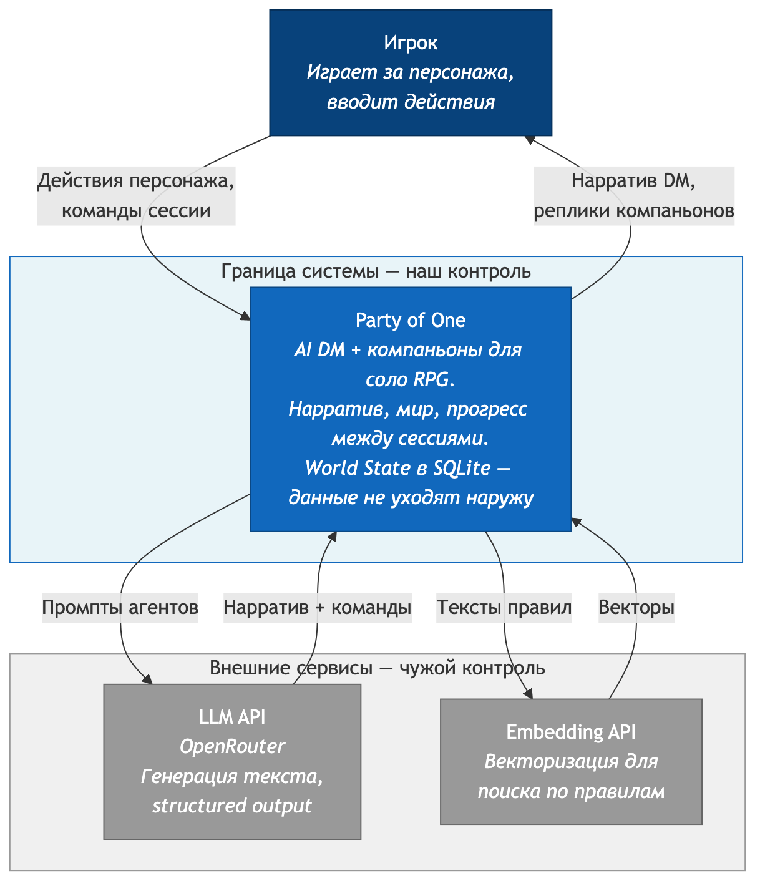

# C4 Context — Party of One

Система сверху: кто с кем разговаривает.

## Границы системы

**Внутри:**
- Оркестрация ходов
- Генерация нарратива (LLM)
- World state — хранение и обновление
- RAG по правилам Cairn
- Guardrails, валидация

**Снаружи:**
- LLM API — без него ничего не работает
- Embedding API — нужен для индексации и поиска правил
- Игрок — единственный живой участник

**Про данные:** world state и логи лежат локально в SQLite. Наружу уходят только промпты к LLM API. Персональных данных в них нет — только игровой контент.
