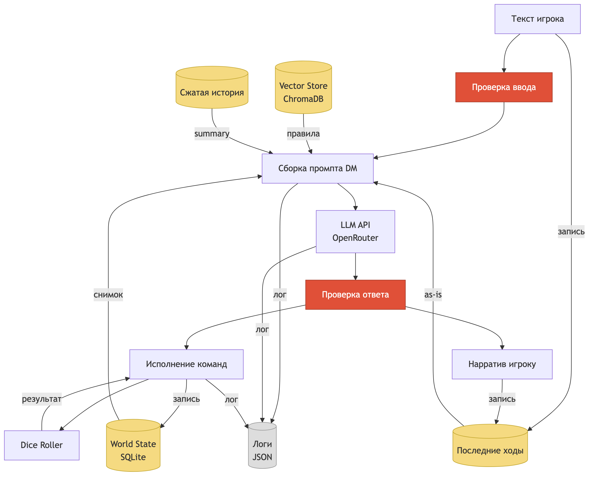
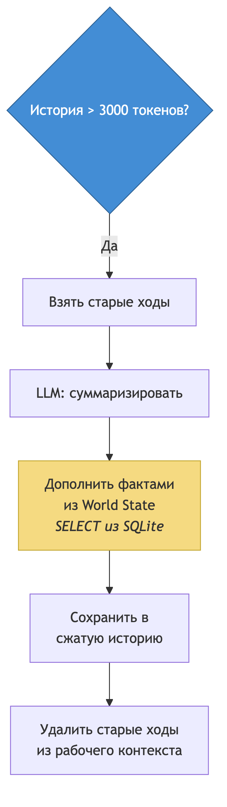
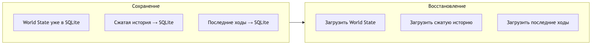

# Data Flow

## Один ход: от ввода до нарратива



## Хранилища

| Хранилище | Что лежит | Формат | Время жизни |
|-----------|-----------|--------|----------|
| **World State (SQLite)** | Персонажи (игрок, компаньоны, NPC), локации, предметы, квесты, события | Реляционные таблицы | Между сессиями |
| **История ходов (in-memory)** | Сырые ходы текущей сессии | Список `{role, content, commands}` | Текущая сессия |
| **Сжатая история (SQLite)** | Краткое изложение старых ходов | Текст | Между сессиями |
| **Vector Store (ChromaDB)** | Эмбеддинги правил Cairn | Векторы + метаданные чанков | Один раз при деплое |
| **Логи** | Промпты, ответы LLM, ошибки, изменения стейта | JSON lines | Файл, без ротации |

## Логирование

На каждый LLM-вызов пишется запись с полным контекстом:

```json
{
  "ts": "2026-03-31T14:23:01.234Z",
  "event": "llm_call",
  "agent": "dm",
  "prompt_version": "dm-v1",
  "turn": 42,
  "round": 14,
  "model": "anthropic/claude-sonnet-4-20250514",
  "prompt_tokens": 4200,
  "completion_tokens": 680,
  "latency_ms": 3200,
  "commands": [
    {"name": "damage_character", "args": {"id": "goblin_1", "amount": 4}, "valid": true},
    {"name": "add_event", "args": {"description": "Игрок убил гоблина"}, "valid": true}
  ],
  "guardrail_pre": "pass",
  "guardrail_post": "pass",
  "retries": 0,
  "error": null
}
```

## Компрессия истории



## Save / restore



## Кто что видит

| Данные | DM-агент | Companion A | Companion B | Игрок |
|--------|----------|-------------|-------------|-------|
| World State (полный) | чтение | чтение | чтение | Частично, через UI |
| World State (запись) | Да, через команды | Нет | Нет | Нет |
| System prompt DM | Да | Нет | Нет | Нет |
| System prompt Companion A | Нет | Да | Нет | Нет |
| System prompt Companion B | Нет | Нет | Да | Нет |
| История ходов | Да | Да | Да | Да |
| Правила Cairn (RAG) | Да | Нет | Нет | Нет |
| Логи | Нет | Нет | Нет | Только чтение через UI |
