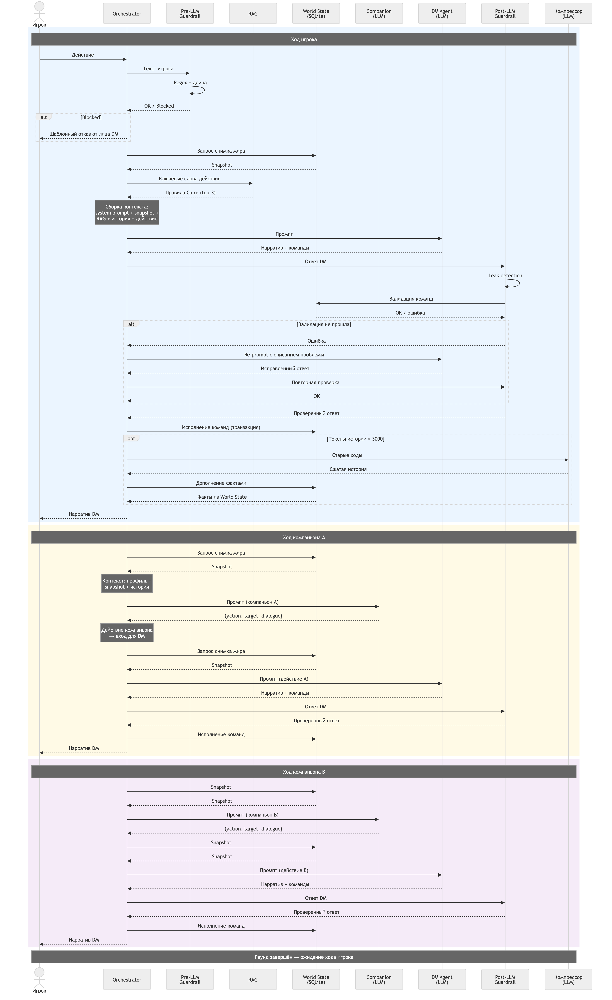

# Sequence — один раунд

Взаимодействие компонентов во времени. Показывает порядок вызовов, кто кого ждёт, где возникают LLM-вызовы.

## Полный раунд

## Что видно на диаграмме

### Ход игрока (синий)

1. Ввод проходит через Pre-LLM Guardrail (regex + длина) — без LLM
2. Orchestrator параллельно собирает World State snapshot и RAG-результаты
3. DM Agent получает собранный контекст, возвращает нарратив + команды
4. Post-LLM Guardrail валидирует: leak detection → проверка команд в SQLite
5. При ошибке валидации — re-prompt DM с описанием проблемы (до 2 раз)
6. Команды исполняются в транзакции SQLite
7. Если история > 3000 токенов — отдельный LLM-вызов на компрессию

### Ход компаньона (жёлтый / розовый)

1. Companion Agent генерирует действие на основе профиля и контекста — **отдельный LLM-вызов**
2. Это действие передаётся DM Agent как входные данные — **ещё один LLM-вызов**
3. Post-LLM Guardrail + исполнение команд — как у игрока

### Итого LLM-вызовов за раунд

| Вызов | Агент | Когда |
|-------|-------|-------|
| 1 | DM | Обработка хода игрока |
| 2 | Companion A | Генерация действия |
| 3 | DM | Обработка действия A |
| 4 | Companion B | Генерация действия |
| 5 | DM | Обработка действия B |
| 6 (опц.) | Компрессор | Если история > порога |

Минимум 5 LLM-вызовов на раунд, максимум 6 + retry.
