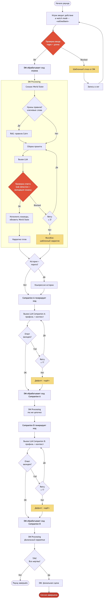
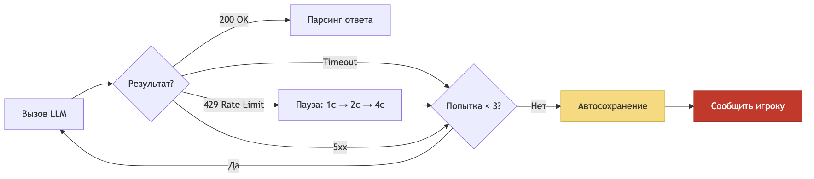

# Workflow — один раунд

Полный цикл обработки раунда, включая ветки ошибок и retry.

## Раунд целиком

## Обработка ошибок LLM API

Применяется к любому LLM-вызову в системе.

## Когда останавливаемся

| Условие | Триггер | Что делаем |
|---------|---------|------------|
| Игрок ушёл | `/quit` или `/save` | Автосохранение, выход |
| Гибель партии (TPK) | HP всех <= 0 | DM пишет финальную сцену |
| Ошибка без восстановления | Retry исчерпаны | Автосохранение, показать ошибку |
